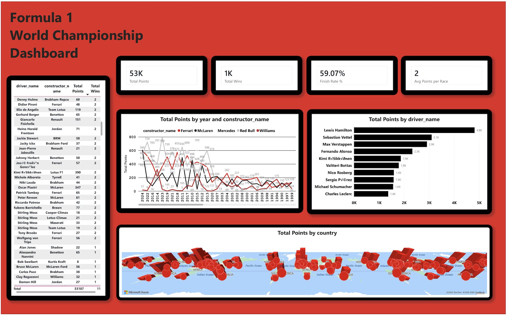

# 🏎️ Formula 1 World Championship Dashboard

An interactive Power BI dashboard built to analyze Formula 1 World Championship data using Excel and Power BI.

## 📊 Dashboard Features

- Total Points KPI
- Total Wins KPI
- Finish Rate
- Average Points per Race
- Top Drivers by Total Points
- Constructor Performance by Year
- Driver Distribution by Country
- Interactive Table

---

## 🛠️ Tools

- Power BI
- Power Query
- Excel
- Data Cleaning
- Data Visualization
- Data Modeling

---

## 📂 Data Source

Formula 1 World Championship (1950–2024)

Source: Kaggle

---

## 📸 Dashboard

---

## 🚀 Files

- F1.pbix
- F1 Dataset.xlsx

---

##Author
Latifa Alnijadi
Computer Science Student
